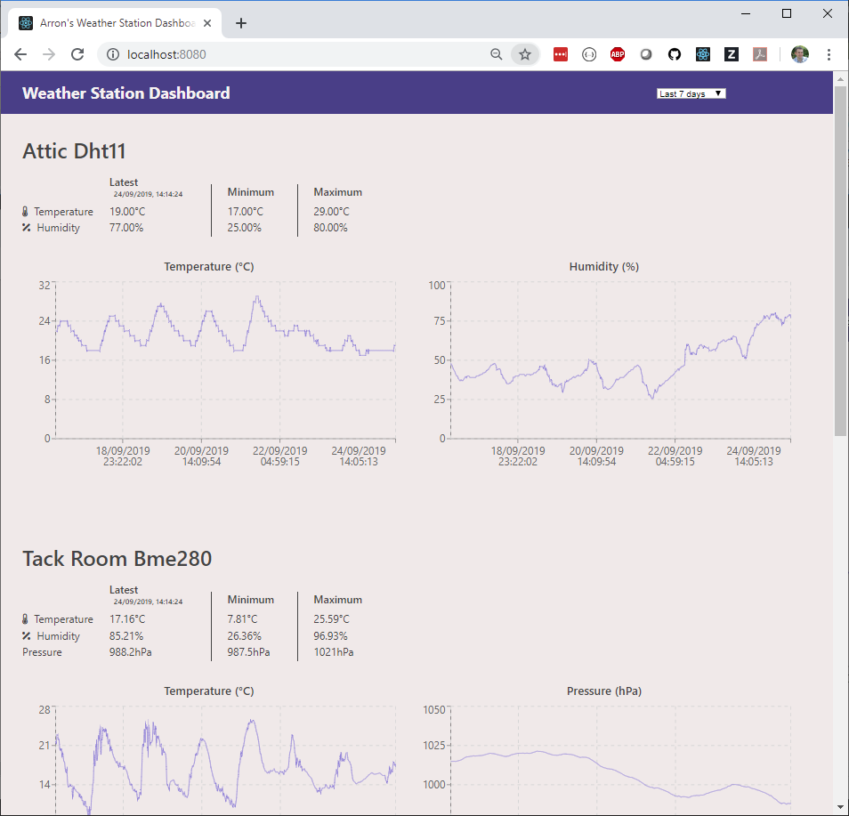
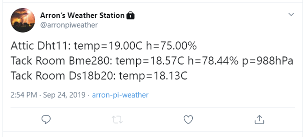

## Introduction
The `pi-weather-app` is a simple node.js application that will allow the weather data collected by instances of the [pi-weather-collector](https://github.com/arronharden/pi-weather-collector) to be viewed using a dashboard implemented in React. It will also periodically send out a Tweet with the latest data collected (you'll need to configure your own Twitter account and API key).

#### Dashboard example


#### Tweet example



## Configuration
Create a copy of the template configuration file in `server/config/app-config-template.json` and save it as `server/config/app-config.json`. Enter the relevant details for the PostgreSQL database to use and the Twitter API key information.

## Development mode
Development mode will start 2 instances of node.js - one serving out the browser UI content (port 3000), and the other serving out the Express based REST APIs (port 8080). The instance serving out the browser UI content uses a proxy configuration in `package.json` which will forward any unknown URLs requested on port 3000 to port 8080 in order to allow the UI to function the same whether running in development or production node.

Both instances of node.js will automatically restart when a change is detected in the relevant source files.

To start in development mode using the default `app_config.json` configuration, run the command:

```
npm run start:dev
```

To start in development mode using the `app_config-mock.json` configuration, run the command:

```
npm run start:dev -- --app_config=mock
```

The dashboard can be viewed using `http://localhost:3000`.


## Production mode
Production mode uses [PM2](http://pm2.keymetrics.io/) to control the single instance of node.js serving both the UI and the Express based APIs. The instance will by default listen on port 8080 and the dashboard can be viewed using `http://localhost:8080`.

To start in production mode, use:

```
npm run build
npm start
```

To stop the instance, use:

```
npm stop
```

Other PM2 commands and be used to manage the running instance. For example, to view the logs use:

Windows:

```
node .\node_modules\pm2\bin\pm2 logs pi-weather-app
```

MacOS/Linux

```
./node_modules/pm2/bin/pm2 logs pi-weather-app
```
